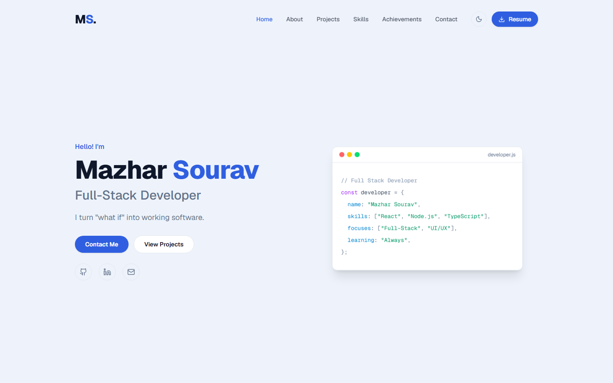

# Mazharul Islam Sourav — Portfolio

My personal portfolio: a single-page site with my background, projects, skills, achievements, a downloadable CV and a working contact form. I'm a full stack developer and Computer Science and Engineering graduate from the University of Asia Pacific, based in Dhaka, Bangladesh.

**Live:** [mazharsourav.me](https://mazharsourav.me)



## Built with

- **[Next.js 16](https://nextjs.org)** (App Router), exported as a static site
- **TypeScript**
- **[Tailwind CSS 4](https://tailwindcss.com)**
- **[Framer Motion](https://motion.dev)** for entrance and scroll animations
- **[Lucide](https://lucide.dev)** icons
- **[Web3Forms](https://web3forms.com)** to deliver contact form messages without a backend
- **GitHub Actions + GitHub Pages** for deployment

## Features

- **Light and dark themes.** Follows the system setting, remembers your choice, and is applied before the page paints, so there's no flash.
- **Responsive** down to phone widths, with a mobile menu.
- **Projects grid** with tags, GitHub and live demo links, and a "Show More" toggle.
- **Draggable achievements row** with arrow buttons and certificate links.
- **One-click CV download** from the navbar and the About section.
- **Contact form** with loading, success and error states, plus a honeypot field against spam bots.
- **Search and sharing ready:**
  - title and description meta tags and a canonical URL
  - `sitemap.xml` and `robots.txt`
  - schema.org `Person` structured data
  - a preview card image for LinkedIn, WhatsApp, Facebook and X

## Running it locally

Requires Node.js 20 or newer.

```bash
npm install
npm run dev       # http://localhost:3000
```

```bash
npm run build     # static export into out/
npm run lint
```

## Project structure

```
.
├── app/
│   ├── layout.tsx                 root layout: fonts, SEO metadata, theme init script
│   ├── page.tsx                   the single page: assembles every section + structured data
│   ├── globals.css                light/dark theme colours and base styles
│   ├── sitemap.ts                 generates sitemap.xml at build time
│   ├── robots.ts                  generates robots.txt at build time
│   ├── opengraph-image.png        link preview card (1200×630)
│   ├── opengraph-image.alt.txt    alt text for the preview card
│   ├── icon.svg                   favicon ("ms" logo)
│   ├── favicon.ico                fallback favicon for older browsers
│   └── apple-icon.png             home-screen icon for iOS
│
├── components/
│   ├── Navbar.tsx                 sticky nav, active section, mobile menu, CV download
│   ├── Hero.tsx                   intro and animated code card
│   ├── About.tsx                  bio, education, experience, photo
│   ├── Projects.tsx               project grid with show more
│   ├── Skills.tsx                 skill categories
│   ├── Achievements.tsx           draggable horizontal row
│   ├── Contact.tsx                contact details and form
│   ├── Footer.tsx                 links and status bar
│   ├── Reveal.tsx                 scroll-into-view animation wrapper
│   ├── ScrollToTop.tsx            floating back-to-top button
│   └── ThemeToggle.tsx            light/dark switch
│
├── lib/
│   ├── data.ts                    ALL site content (see below)
│   └── styles.ts                  shared Tailwind class strings and link helpers
│
├── public/
│   ├── Mazharul_Islam_Sourav_Resume.pdf
│   ├── main-image.jpg             profile photo
│   └── projects/                  project thumbnails
│
└── .github/
    ├── workflows/deploy.yml       build and publish to GitHub Pages
    └── screenshots/               README screenshots
```

## License

The code is released under the [MIT License](LICENSE), so you're welcome to learn from and reuse it. The content, photos, CV and personal details are mine, so please replace them with your own.
